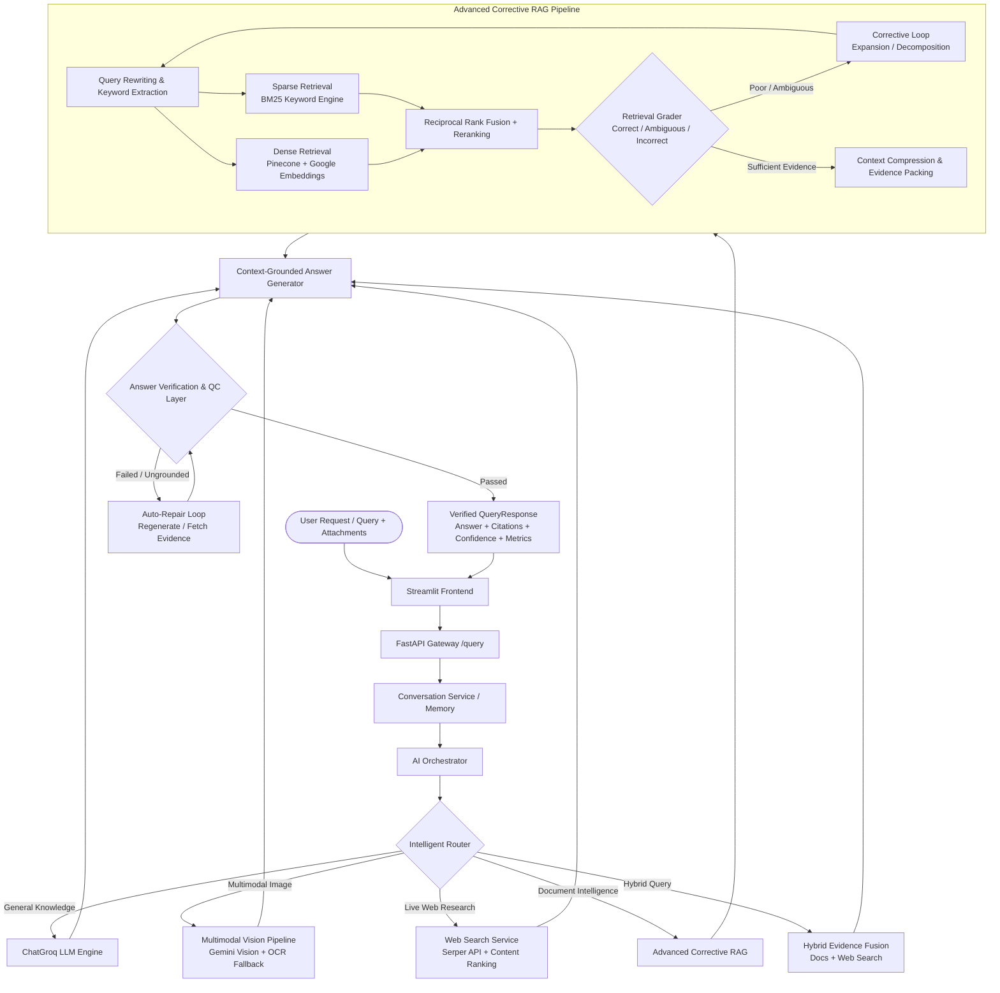

# 🧠 Nexora AI — Multimodal Agentic Assistant with Advanced Corrective RAG (CRAG)

<div align="center">

**A production-grade, multimodal AI assistant featuring Intelligent Intent Routing, Advanced Corrective RAG (CRAG), Live Web Research, Multimodal Vision Understanding, and Post-Generation Quality Control.**

[](https://www.python.org/)
[](https://fastapi.tiangolo.com/)
[](https://streamlit.io/)
[](https://www.langchain.com/)
[](https://www.pinecone.io/)
[](https://groq.com/)
[](https://aistudio.google.com/)
[](LICENSE)

</div>

---

## 📖 Overview

**Nexora AI** is an advanced, production-style multimodal AI assistant engineered to overcome the classic pitfalls of traditional naive RAG chatbots. Rather than forcing every question down a rigid vector search path, Nexora operates like a modern, agentic AI platform (similar to ChatGPT / Perplexity):

1. **Intelligent Router**: Intelligently classifies query intent and dynamically routes between General Knowledge, Document RAG, Live Web Research, Multimodal Vision, or Hybrid synthesis.
2. **Multimodal Input Pipeline**: Distinguishes between visual understanding (photographs, charts, diagrams) and text extraction (scanned PDFs, OCR documents, spreadsheets), rendering inline image previews in the UI.
3. **Advanced Corrective RAG (CRAG)**: Combines dense vector retrieval (Pinecone) with sparse keyword retrieval (BM25), applies Reciprocal Rank Fusion (RRF), cross-encoder reranking, retrieval grading, and dynamic query rewriting with bounded correction loops.
4. **Live Web Research Tool**: Autonomously executes real-time web search (via Serper API) for time-sensitive queries, explicit web search requests, or as a seamless fallback when document context is insufficient.
5. **Answer Verification & Quality Control**: Evaluates generated responses for factual grounding, relevance, citation fidelity, and hallucination risk, triggering automated answer repair loops when claims lack evidence.
6. **Redesigned Modern UI**: Features execution mode switching (`Auto`, `Live Web`, `Document RAG`, `Hybrid`, `General`), route badges, verified citation chips, and an interactive **Quality & Grounding Inspector**.

---

## 🏗️ System Architecture



---

## 🌟 Key Capabilities & Phases

### 1. 🤖 AI Orchestrator & Intelligent Router (Phase 1)
- **Separation of Concerns**: Query understanding is decoupled from tool execution.
- **Typed `RoutingDecision`**: Evaluates intent (`general_knowledge`, `document_qa`, `web_research`, `image_qa`, `hybrid`), required resources, confidence scores, and router reasoning.
- **Dynamic Routing Rules**:
  - Explicit web research requests ("*search online*", "*look this up*") always trigger web search.
  - Document retrieval failures gracefully fall back to web search or general knowledge rather than abruptly terminating.
  - General conversational queries do not trigger wasteful vector lookups.
  - Flexible execution mode overrides: `AUTO`, `WEB_SEARCH`, `DOCUMENT_RAG`, `HYBRID`, and `GENERAL_LLM`.

### 2. 👁️ Multimodal Input Pipeline (Phase 2)
- **Image Understanding vs. Text Extraction**: Fixed the legacy flaw where photographs were rejected due to "no OCR text". Human photos, diagrams, and artwork are directly understood by Gemini Vision.
- **Multi-Format Ingestion**: Supports `.pdf` (text & scanned), `.docx`, `.txt`, `.csv`, `.xlsx`, and images (`.png`, `.jpg`, `.jpeg`, `.webp`).
- **Scanned Document Processing**: Automatically renders scanned PDF pages, performs OCR fallback (Tesseract), and indexes structured text for retrieval.
- **Inline Image Previews**: Attached images are displayed directly inside user chat messages in the Streamlit UI.

### 3. 🔬 Advanced Hybrid + Corrective RAG (CRAG) (Phase 3)
- **Hybrid Retrieval**: Queries both dense vector embeddings (Pinecone serverless) and BM25 sparse keyword indices simultaneously.
- **Reciprocal Rank Fusion (RRF)**: Merges dense and sparse ranks to optimize recall for exact keyword terms, medical nomenclature, and semantic concepts alike.
- **Cross-Encoder Reranking**: Re-scores candidate passages based on query relevance before sending to the LLM.
- **Retrieval Grader**: Classifies retrieved context as `CORRECT`, `AMBIGUOUS`, or `INCORRECT`.
- **Corrective Query Rewriting**: If evidence quality is low, the pipeline rewrites the query, expands synonyms, decomposes multi-part questions, and re-retrieves (strictly bounded by `MAX_CORRECTION_ATTEMPTS = 2` to prevent infinite loops).

### 4. 🌐 Live Web Search Integration (Phase 4)
- **Dedicated Web Search Tool**: Powered by Serper API / Google Search API.
- **Automatic & Fallback Activation**: Triggered automatically for time-sensitive questions or whenever document RAG yields insufficient evidence.
- **Structured Web Evidence**: Cleans search snippets, removes untrusted prompt injections, filters domains, ranks relevance, and formats rich web citation metadata.
- **Hybrid Fusion**: Blends internal document knowledge with real-time web results for comprehensive comparative answers.

### 5. 🛡️ Post-Generation Answer Verification & Quality Control (Phase 5)
- **Factual Grounding Evaluation**: Assesses whether every claim in the answer is backed by retrieved evidence.
- **Multi-Dimensional Metrics**:
  - **Grounding Score** (0.0 – 1.0): Context support ratio.
  - **Relevance Score** (0.0 – 1.0): Direct alignment to user prompt.
  - **Citation Fidelity** (0.0 – 1.0): Accurate mapping of claims to source passages.
  - **Evidence Coverage** (0.0 – 1.0): Completeness of context utilization.
  - **Hallucination Risk**: Categorized as `LOW`, `MEDIUM`, or `HIGH`.
- **Self-Correction & Auto-Repair Loop**: If ungrounded claims or hallucinations are detected, the orchestrator triggers an automatic answer repair loop (`MAX_VERIFICATION_REPAIRS = 1`).

### 6. 💻 Redesigned Streamlit UI
- **Execution Mode Selector**: Quick switch between `Auto`, `Live Web`, `Document Intelligence`, `Hybrid`, and `General Assistant`.
- **Quality & Grounding Inspector**: Collapsible drawer revealing calculated confidence scores, diagnostic meters, orchestrator reasoning, and auto-repair notifications.
- **Engine Badges**: Visual tags identifying the execution path (`Live Web Research`, `Document Intelligence`, `Hybrid`, `Multimodal Vision`, `General Knowledge`).
- **Rich Citation Chips**: Document citations with page numbers (`Pages 2, 4`) and clickable live web links (`target="_blank"`).

---

## 📂 Project Directory Structure

```
ai_medical_rag_chat_bot/
├── backend/
│   ├── main.py                      # FastAPI application entrypoint & middleware setup
│   ├── config.py                    # Centralized settings & environment configuration
│   ├── logger.py                    # Structured logging setup
│   ├── schemas.py                   # Pydantic data models (QueryRequest, RoutingDecision, VerificationResult)
│   ├── middlewares/
│   │   └── exception_handlers.py    # Global exception middleware
│   ├── routes/
│   │   ├── query.py                 # POST /query — Intelligent orchestrator endpoint
│   │   ├── documents.py             # POST /documents/upload, GET /documents, DELETE /documents
│   │   ├── vision.py                # POST /vision/query — Direct vision LLM endpoint
│   │   ├── conversation.py          # Multi-turn conversation session management
│   │   ├── upload_pdfs.py           # Legacy backward-compatible PDF upload endpoint
│   │   └── ask_question.py          # Legacy backward-compatible ask endpoint
│   ├── services/
│   │   ├── orchestrator_service.py  # Central AI Orchestrator coordination
│   │   ├── query_router.py          # Intelligent Intent Router & classification
│   │   ├── retriever_service.py     # Hybrid retrieval, BM25, RRF, Reranker, CRAG Grader & Rewriter
│   │   ├── answer_service.py        # Context packing, LLM generation, QC repair loop execution
│   │   ├── verification_service.py  # Factual grounding, hallucination scoring & verification
│   │   ├── web_search_service.py    # Serper API web search, result filtering & evidence ranking
│   │   ├── multimodal_service.py    # File classification, text vs. visual routing
│   │   ├── ocr_vision_service.py    # Gemini Vision + Tesseract OCR fallback engine
│   │   ├── document_service.py      # Multi-format document parser (PDF, DOCX, CSV, XLSX, TXT)
│   │   ├── vectorstore_service.py   # Pinecone serverless vector index operations
│   │   ├── embedding_service.py     # Google Generative AI embeddings
│   │   ├── conversation_service.py  # Multi-turn chat history & memory
│   │   ├── calculator_service.py    # Deterministic mathematical validation
│   │   └── citation_service.py      # Document & web citation formatting
│   └── tests/                       # Complete pytest suite (40+ integration tests)
│       ├── test_router_orchestrator.py
│       ├── test_multimodal.py
│       ├── test_crag_retrieval.py
│       ├── test_web_search_phase4.py
│       ├── test_verification_phase5.py
│       └── test_failure_modes.py
├── frontend/
│   ├── utils/
│   │   ├── app.py                   # Streamlit application entrypoint
│   │   ├── api.py                   # Frontend HTTP client
│   │   └── config.py                # Frontend configuration
│   └── components/
│       ├── chatUI.py                # Chat interface, inspector drawer, badges, composer pills
│       ├── sidebar.py               # Mode switcher, document manager, settings
│       ├── citations.py             # Citation chip normalizers (doc & web)
│       ├── upload.py                # Document & image ingestion UI
│       ├── history_download.py      # Conversation export utility
│       ├── state.py                 # Streamlit session state management
│       └── theme.py                 # Design tokens, CSS stylesheets & SVG icons
├── requirements.txt
├── .env.example
├── .gitignore
└── README.md
```

---

## ⚡ Tech Stack

| Component | Technology |
|---|---|
| **Backend Framework** | [FastAPI](https://fastapi.tiangolo.com/) + Uvicorn |
| **Frontend Framework** | [Streamlit](https://streamlit.io/) (1.38+) |
| **LLM Inference** | [Groq](https://groq.com/) (`llama-3.3-70b-versatile` / `openai/gpt-oss-120b`) |
| **Multimodal Vision** | Google [Gemini Vision](https://ai.google.dev/) (`gemini-2.5-flash` / `gemini-1.5-flash`) |
| **Embeddings** | Google Generative AI (`gemini-embedding-001` / `text-embedding-004`) |
| **Vector Store** | [Pinecone](https://www.pinecone.io/) Serverless Index |
| **Sparse Retrieval** | `rank-bm25` (BM25Okapi) |
| **Web Search Provider**| [Serper](https://serper.dev/) Google Search API |
| **OCR Fallback** | `pytesseract` + `Pillow` |
| **Document Parsers** | `pypdf`, `python-docx`, `pandas`, `openpyxl` |
| **Testing Suite** | `pytest`, `pytest-asyncio`, Starlette TestClient |

---

## 🚀 Quickstart Guide

### 1. Prerequisites
- **Python 3.11+** installed
- Free API keys for:
  - [Groq Console](https://console.groq.com/keys) (Fast LLM inference)
  - [Pinecone](https://app.pinecone.io/) (Vector store)
  - [Google AI Studio](https://aistudio.google.com/app/apikey) (Vision & Embeddings)
  - [Serper API](https://serper.dev/) (Live Web Search)
  - *(Optional)* [Tesseract OCR](https://github.com/tesseract-ocr/tesseract) installed on your system path for offline OCR

### 2. Clone Repository & Setup Virtual Environment
```bash
git clone https://github.com/lalkesh-ds/nexora-ai.git
cd nexora-ai

# Create virtual environment
python -m venv myenv

# Activate virtual environment
# Windows (PowerShell):
.\myenv\Scripts\Activate.ps1
# macOS / Linux:
source myenv/bin/activate
```

### 3. Install Dependencies
```bash
pip install -r requirements.txt
```

### 4. Configure Environment Variables
Create a `.env` file in the root directory:
```env
# LLM & Vision
GROQ_API_KEY=your_groq_api_key
GROQ_MODEL=llama-3.3-70b-versatile
GOOGLE_API_KEY=your_google_ai_studio_key
GEMINI_VISION_MODEL=gemini-2.5-flash

# Vector Store & Embeddings
PINECONE_API_KEY=your_pinecone_api_key
PINECONE_INDEX_NAME=nexora-medical-rag
EMBEDDING_MODEL=models/gemini-embedding-001

# Web Search
SERPER_API_KEY=your_serper_api_key

# Advanced CRAG & Quality Control Settings
MAX_CORRECTION_ATTEMPTS=2
MAX_VERIFICATION_REPAIRS=1
```

### 5. Launch the Application

#### Start the FastAPI Backend:
```bash
uvicorn backend.main:app --host 0.0.0.0 --port 8000 --reload
```
*API documentation is available at `http://localhost:8000/docs`.*

#### Start the Streamlit Frontend (in a separate terminal):
```bash
streamlit run frontend/utils/app.py
```
*The web interface will open at `http://localhost:8501`.*

---

## 🔌 API Reference

### `POST /query` (Intelligent Orchestrator)
The primary endpoint for all assistant interactions.

**Request Payload:**
```json
{
  "question": "What are the latest clinical recommendations in the uploaded report?",
  "session_id": "optional-session-uuid",
  "document_ids": ["doc_abc123"],
  "mode": "AUTO"
}
```
*`mode` options: `"AUTO"`, `"WEB_SEARCH"`, `"DOCUMENT_RAG"`, `"HYBRID"`, `"GENERAL_LLM"`, `"VISION"`.*

**Response Schema:**
```json
{
  "answer": "According to the uploaded clinical trial report (Page 4)...",
  "route_used": "DOCUMENT_RAG",
  "session_id": "84c8a2b1-...",
  "document_citations": [
    {
      "filename": "Clinical_Trial_Report.pdf",
      "document_id": "doc_abc123",
      "page_number": 4,
      "snippet": "Primary endpoint achieved with 34% reduction in symptoms...",
      "score": 0.89
    }
  ],
  "web_citations": [],
  "evidence": {
    "from_documents": true,
    "from_web": false,
    "from_general_knowledge": false
  },
  "warnings": [],
  "routing": {
    "intent": "document_qa",
    "sources": ["document"],
    "confidence": 0.98,
    "reasoning": "Query asks about uploaded report findings."
  },
  "verification": {
    "passed": true,
    "confidence_score": 0.96,
    "evidence_grounding": 0.97,
    "answer_relevance": 0.95,
    "citation_support": 1.0,
    "evidence_coverage": 0.92,
    "hallucination_risk": "low",
    "unsupported_claims": [],
    "repair_attempts": 0
  }
}
```

---

### `POST /vision/query` (Direct Vision Analysis)
Dedicated endpoint for direct image and visual reasoning.

**Request:** `multipart/form-data`
- `image`: Image file (`.jpg`, `.png`, `.webp`)
- `question`: "Analyze the symptoms shown in this rash and describe key visual features."

---

### `POST /documents/upload`
Uploads and indexes documents (`.pdf`, `.docx`, `.txt`, `.csv`, `.xlsx`, `.png`, `.jpg`).
```bash
curl -X POST "http://localhost:8000/documents/upload" \
  -F "files=@research_paper.pdf"
```

---

## 🧪 Testing & Verification

The backend includes comprehensive test suites covering all system layers:
```bash
# Run all backend unit & integration tests
pytest backend/tests/

# Run specific phase test suites
pytest backend/tests/test_router_orchestrator.py   # Router & Orchestrator
pytest backend/tests/test_multimodal.py            # Multimodal Pipeline
pytest backend/tests/test_crag_retrieval.py        # Hybrid CRAG & Rewriting
pytest backend/tests/test_web_search_phase4.py     # Live Web Search
pytest backend/tests/test_verification_phase5.py   # Quality Control & Verification
pytest backend/tests/test_failure_modes.py         # Graceful Fallbacks & Edge Cases
```

---

## 🤝 Contributing

Contributions, feedback, and pull requests are warmly welcomed!
1. Fork the Project
2. Create your Feature Branch (`git checkout -b feature/NewFeature`)
3. Commit your Changes (`git commit -m 'Add NewFeature'`)
4. Push to the Branch (`git push origin feature/NewFeature`)
5. Open a Pull Request

---

## 📄 License

Distributed under the **MIT License**. See [LICENSE](LICENSE) for more details.

---

## 👤 Author

**Lalkesh Yaduvanshi**
*AI / Machine Learning Engineer & Data Scientist*

- **GitHub**: [@lalkesh-ds](https://github.com/lalkesh-ds)
- **Email**: lalkeshyaduvanshi65@gmail.com

<div align="center">

⭐ **If you find Nexora AI useful, please consider giving it a star on GitHub!** ⭐

</div>
